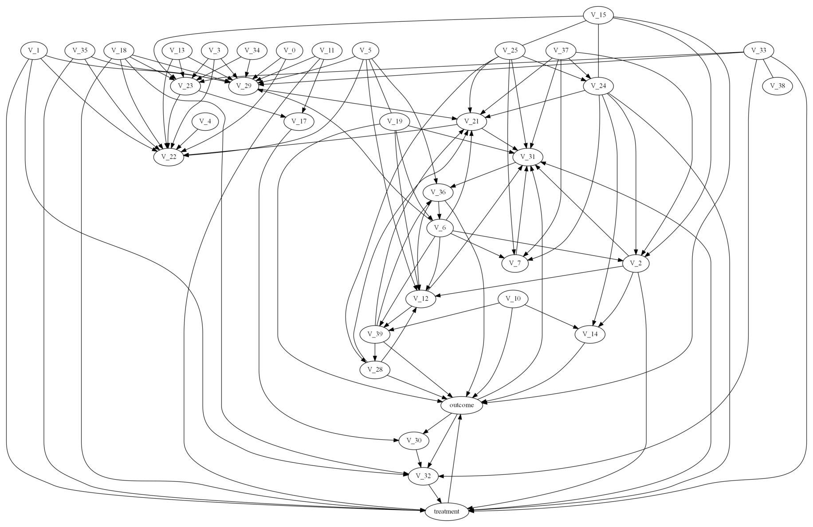
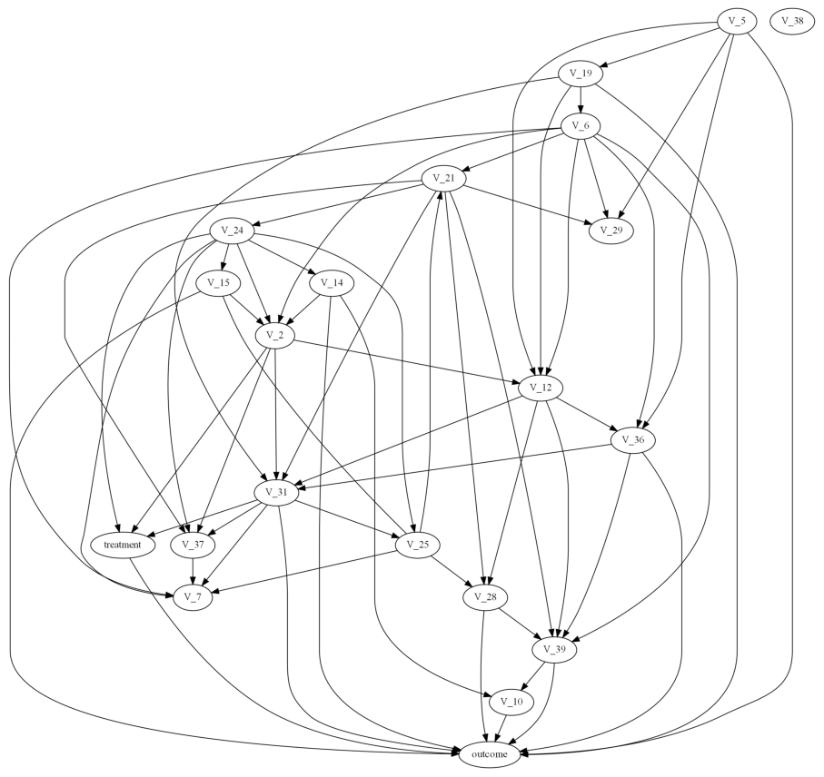
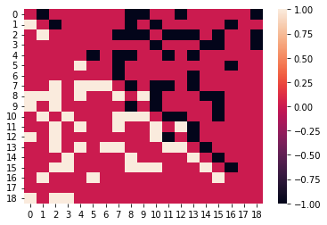
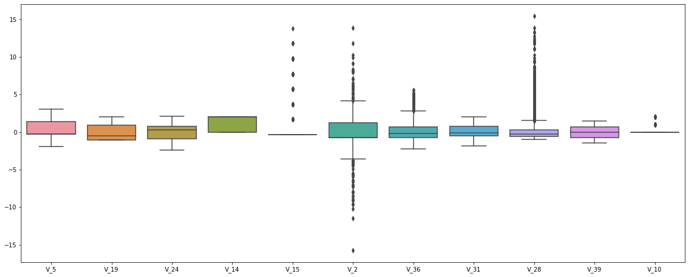

# causal-WAIC2022Hackathon
2022 WAIC 黑客松九章云极赛道-因果学习和决策优化挑战赛 Top 8     
[阿里云天池赛事地址](https://tianchi.aliyun.com/competition/entrance/532019/introduction?spm=5176.12281925.0.0.124c7137VX1Tht)     
author：SheltonXiao     
队名：因果小白桶
## 运行环境
运行环境涉及的主要安装包如下：
> scikit-learn == 1.0.2    
> lightgbm == 3.3.2    
> causal-learn == 0.1.2.8    
> lightgbm == 3.3.2    
> optuna == 2.10.1    
> ylearn == 0.1.3    
> sweetviz == 2.1.4    
> missingno == 0.5.1
## 文件结构
> |-- causal-WAIC2022Hackathon    
> |        |-- README.md    
> |        |-- code     
> |        |         |-- A01 causal_discovery.ipynb      
> |        |         |-- A02 treatment prediction.ipynb      
> |        |-- data     
> |        |         |-- test.csv      
> |        |         |-- train.csv      
> |        |         |-- processed      
> |        |         |        |-- test_cleaned.csv      
> |        |         |        |-- test_nn.csv      
> |        |         |        |-- test_nnfilled3.csv      
> |        |         |        |-- train_cleaned.csv     
> |        |         |        |-- train_label.csv      
> |        |         |        |-- train_label2.csv      
> |        |         |        |-- train_nn.csv       
> |        |         |        |-- train_nnfilled3.csv     
> |        |-- datareport     
> |        |         |-- train_outcome_treatment1.html     
> |        |         |-- train_outcome_treatment2.html     
> |        |         |-- train_outcome_treatment_no0.html     
> |        |-- output     
> |        |         |-- result.csv     
> |        |         |-- result082205 5fold07445.csv     
> |        |-- pic     
> |        |         |-- output1.png     
> |        |         |-- output2.png    
> |        |         |-- output3.png    
> |        |         |-- output4.png    
## 实现过程
### 1 causal discovery & data preprocessing
涉及代码含于 code/A01 causal_discovery.ipynb中，包含以下几个步骤：
#### 1.1 数据基础处理
这个处理主要是作为因果发现的输入，修改自赛事提供baseline的基本结构，包含    
- 均值填充缺失值     
- 除了outcome列之外，数值特征标准化，非数值特征编码
#### 1.2 EDA 数据探索性分析
对treatment = 0，1，2 分别进行EDA，调用sweetviz出报告进行分析，生成的报告在datareport文件夹中。     
可以发现treatment = 1存在类别不均衡。
#### 1.3 causal discovery 因果发现
综合考虑，采用casual-learn实现的PC算法，分为以下几步：     
- 去除关联弱的变量      
    此处参考赛事提供baseline的变量重要性方法，把此部分变量去除后有效提高了PC的计算速度。     
- 对所有变量进行PC算法因果发现     
        
- 分组      
    结合题目提供的图，可以将变量分成两组     
    ```python
        W1C = ["V_"+str(each) for each in [5,19,6,21,24,14,15,2,12,36,31,37,7,25,28,39,10]]
        C1W = ["V_"+str(each) for each in [1,32,30,11,18,35]]
    ```     
- 对分组后的变量进行PC算法因果发现     
         
    可以进一步挑选跟outcome，treatment直接相关的变量作为模型输入（以减少过拟合）。     
#### 1.4 data preprocessing 数据预处理
分为两部分，一部分是填补缺失数据，在赛事提供baseline的基本结构上修改；另一部分是根据数据离群情况进行分片后填补数据。此部分只补了变量集W1C中的数据。     
- 填补缺失数据    
    
根据因果发现探索得出的因果图上，待补节点的相邻节点数据，训练模型进行填补。处理后数据存储在data/processed/train_nnfilled3.csv，data/processed/test_nnfilled3.csv。
- 根据数据离群情况进行分片后填补数据    
    
针对变量V_28，其存在较多离群数据，同时又是缺失数据列，故对数据进行分片处理后填补数据。处理后数据存储在data/processed/train_cleaned.csv，data/processed/test_cleaned.csv，分片的mask存储在data/processed/train_label.csv，data/processed/train_label2.csv。
### 2 treatment prediction
涉及代码含于 code/A02 treatment prediction.ipynb中，此处只摘选了形成最后结果的模型，中间还尝试过ecoml提供的因果森林，以及更换过dml的基模型为xgboost或lightgbm，但效果均为达到预期。包含以下几个步骤：
#### 2.1 基础模型的训练
- Model 1：随机森林的dml，使用ylearn的DML4CATE实现。线上验证显示对数据量不足的treatment = 1单模型预测效果最好。
- Model 2：随机森林的dml，使用ylearn的DML4CATE实现，对类别特征进行one-hot编码，并且经过参数寻优。线上验证显示对数据量不足的treatment = 1过拟合，预测偏大。
- Model 3：随机森林+随机森林+线性回归的双鲁棒模型，使用ylearn的DoublyRobust实现。线上验证显示对数据量不足的treatment = 1过拟合，预测偏小，但输出正态性好。
- Model 4：随机森林的dml，使用ylearn的DML4CATE实现，经过参数寻优。线上验证显示对数据量较为充足的treatment = 2单模型预测效果较好。
- Model 5：随机森林的dml，使用ylearn的DML4CATE实现，使用分片填补的数据，对类别特征进行one-hot编码，并且经过参数寻优。对未离群的变量V_28所对应的数据列的预测负责。
#### 2.2 模型融合
由于未找到较好的线下验证方式，这里模型融合主要是使不同模型承担不同部分的预测功能，并对预测结果进行简单的数据融合。
- 融合模型1：Model 1&2&3 目标是数据量不足的treatment = 1线上预测效果最佳，Model 4 目标是treatment = 2线上预测效果最佳。结果对应output/result082205 5fold07445.csv。
- 融合模型2：Model 5 负责分片填补的数据的预测，融合模型1负责离群的变量V_28所对应的数据列的预测。
- 融合模型3：组合融合模型1及融合模型2，使线上预测效果最佳。结果对应output/result.csv为最终的结果文件。
由于可能存在未完全固定的random_seed，代码生成结果与output/result.csv细微的偏差，经计算两结果间nrmse<0.01。
#### 2.3 部分支撑代码：参数寻优
以ylearn中的rloss最小作为目标函数，使用optuna进行参数寻优。
